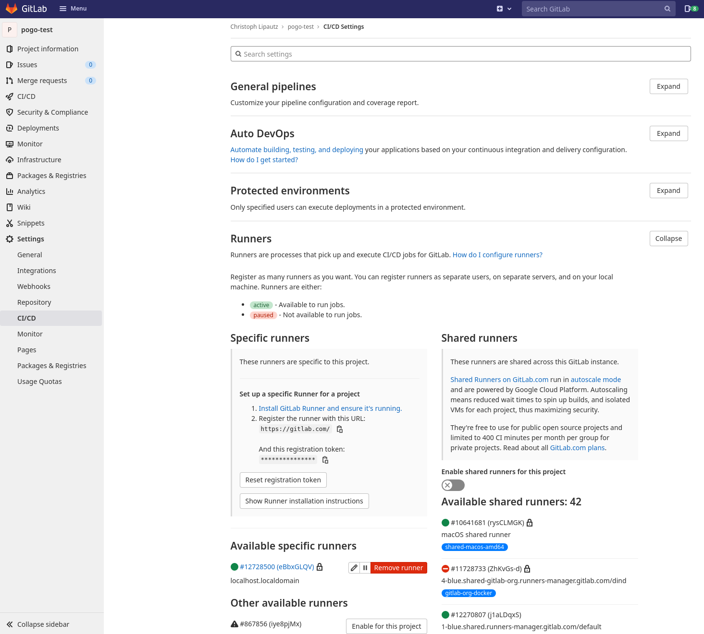
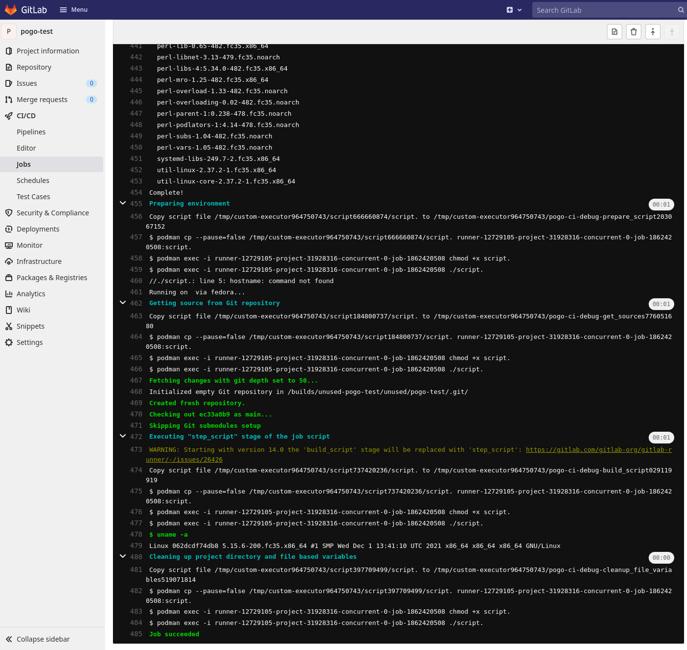

# Pogo Test

A simple GitLab project to test the custom podman executor
[pogo](https://github.com/eyeson-team/pogo).



## Usage

First lets setup a GitLab runner with pogo. We will work throughout this
example with a home directory at `/home/me` so ensure you replace it with
yours.

```sh
$ echo $HOME
/home/me
$ which podman # ensure podman is present
/usr/bin/podman
# Download latest release from https://github.com/eyeson-team/pogo/releases
$ wget -O $HOME/bin/pogo https://github.com/eyeson-team/pogo/releases/download/v0.1.0/pogo
# Download latest gitlab-runner
$ wget -O $HOME/bin/gitlab-runner https://gitlab-runner-downloads.s3.amazonaws.com/latest/binaries/gitlab-runner-linux-amd64
$ chmod u+x $HOME/bin/{pogo,gitlab-runner}
```

GitLab runner is a process we want to run on our computer (or server) without
the need to start it every time we run a CI pipeline. My system is based on
Fedora Linux that makes the choice straightforward to go with
[systemd](https://www.freedesktop.org/wiki/Software/systemd/) on a user level.
Copy the [systemd service example
file](https://github.com/eyeson-team/pogo/blob/main/gitlab-runner.service) and
adapt it to your needs.

```sh
$ mkdir -p ~/.config/systemd/user
$ cp gitlab-runner.service ~/.config/systemd/user
$ systemctl --user enable gitlab-runner
$ systemctl --user start gitlab-runner
$ systemctl --user status gitlab-runner
```

Now we register the GitLab runner for your project, group or setup a shared
one. We go for a project here. Go to the CI/CD settings at
`https://gitlab.com/<user>/<project>/-/settings/ci_cd`. Disable shared runners,
then copy the URL. If using a self-hosted GitLab, replace it in the script
below `GITLAB_URL=<your-gitlab-url>`. Keep the settings open you will need to
enter the registration token as well.

Running the command proceed with the following steps: Ignore the warnings about
running in "user-mode". Confirm the gitlab url. Enter the registration
token. Change the description on demand. Add some tags for your runner on
demand. Confirm `custom` as the executor.

Additionally prepare a minimal pogo configuration file that sets the working
and cache directory on your client machine and define a default container
image.

```sh
$ mkdir ~/pogo/{,cache,bin}
$ cp ~/bin/gitlab-runner ~/pogo/bin/
$ wget -O ~/pogo/bin/install-packages https://raw.githubusercontent.com/eyeson-team/pogo/main/bin/install-packages
$ chmod u+x ~/bin/install-packages
$ cat ~/.pogo.yaml
# .pogo.yaml
default_image: fedora:latest
working_dir: /home/me/pogo
cache_dir: /home/me/pogo/cache

$ export GITLAB_URL=https://gitlab.com/
$ gitlab-runner register \
    --url "$GITLAB_URL" \
    --name "$HOSTNAME runner" \
    --executor custom \
    --shell bash \
    --builds-dir /builds \
    --cache-dir /cache \
    --custom-config-exec "/home/me/bin/pogo" \
    --custom-config-args "config" \
    --custom-config-args "--config" \
    --custom-config-args "/home/me/.pogo.yaml" \
    --custom-prepare-exec "/home/me/bin/pogo" \
    --custom-prepare-args "prepare" \
    --custom-prepare-args "--config" \
    --custom-prepare-args "/home/me/.pogo.yaml" \
    --custom-run-exec "/home/me/bin/pogo" \
    --custom-run-args "run" \
    --custom-run-args "--config" \
    --custom-run-args "/home/me/.pogo.yaml" \
    --custom-cleanup-exec "/home/me/bin/pogo" \
    --custom-cleanup-args "clean" \
    --custom-cleanup-args "--config" \
    --custom-cleanup-args "/home/me/.pogo.yaml"

WARNING: Running in user-mode
WARNING: The user-mode requires you to manually start builds processing:
WARNING: $ gitlab-runner run
WARNING: Use sudo for system-mode:
WARNING: $ sudo gitlab-runner...

Enter the GitLab instance URL (for example, https://gitlab.com/):
[https://gitlab.com/]:
Enter the registration token:
**************
Enter a description for the runner:
[fedora runner]:
Enter tags for the runner (comma-separated):

Registering runner... succeeded                     runner=1234abcd
Enter an executor: parallels, shell, ssh, virtualbox, custom, docker,
docker-ssh, docker+machine, docker-ssh+machine, kubernetes:
[custom]:

Runner registered successfully. Feel free to start it, but if it s running
already the config should be automatically reloaded!
```

No worries, you can edit the configuration - found at
`~/.gitlab-runner/config.toml` afterwards. Don't forget to restart the systemd
service `$ systemctl --user restart gitlab-runner`. A common thing to edit is
to increase the concurrency so you can run multiple jobs in parallel.

Now enable your runner in the project settings and give it a go.


